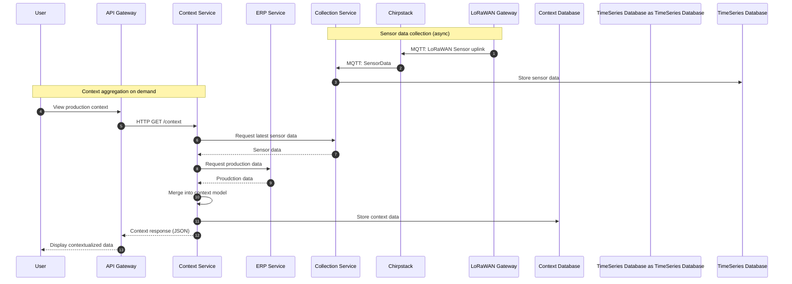

```mermaid
sequenceDiagram
    autonumber

    %% Participants
    participant User
    participant APIGateway as API Gateway
    participant ContextService as Context Service
    participant ERPService as ERP Service
    participant CollectionService as Collection Service
    participant Chirpstack
    participant LoRaWAN_Gateway as LoRaWAN Gateway
    participant Database as Context Database
    participant TimeSeries Database as TimeSeries Database

    %% Sensor data collection
    Note over LoRaWAN_Gateway,CollectionService: Sensor data collection (async)
    LoRaWAN_Gateway ->> Chirpstack: MQTT: LoRaWAN Sensor uplink
    Chirpstack ->> CollectionService: MQTT: SensorData
    CollectionService ->> TimeSeries Database: Store sensor data

    

    %% User requests context
    Note over User,ContextService: Context aggregation on demand
    User ->> APIGateway: View production context
    APIGateway ->> ContextService: HTTP GET /context

    ContextService ->> CollectionService: Request latest sensor data
    CollectionService -->> ContextService: Sensor data

    ContextService ->> ERPService: Request  production data
    ERPService -->> ContextService: Proudction data

    ContextService ->> ContextService: Merge into context model
    
    %% Production / machine data ingestion
    ContextService ->> Database: Store context data
    
    ContextService -->> APIGateway: Context response (JSON)
    APIGateway -->> User: Display contextualized data

```
